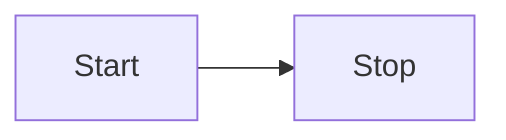
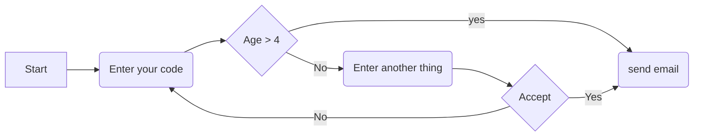
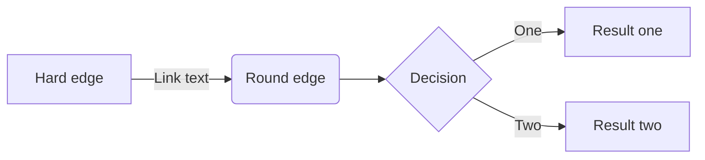
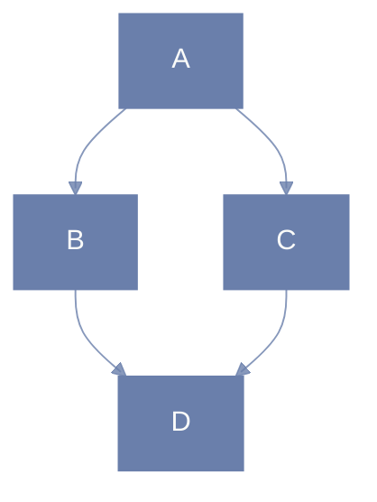
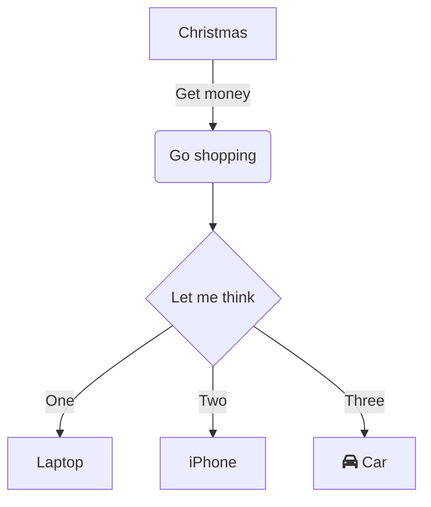
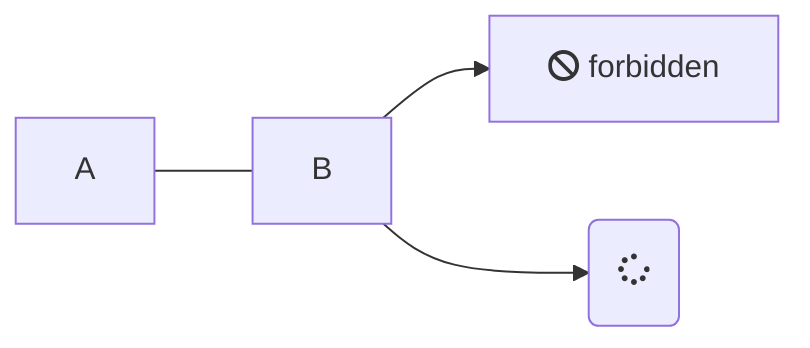
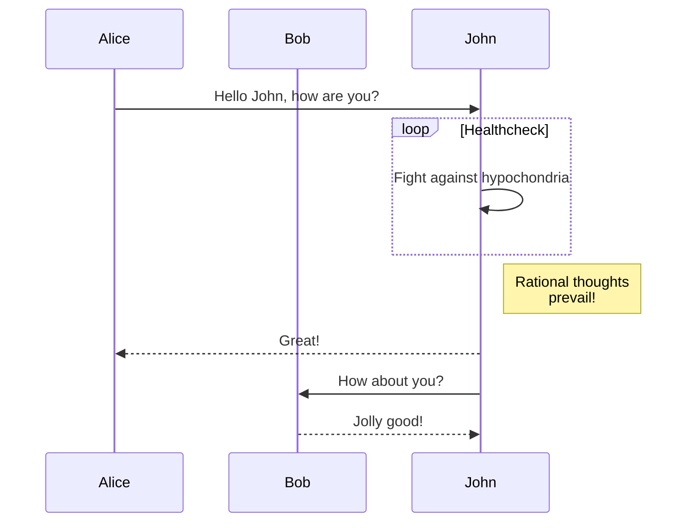
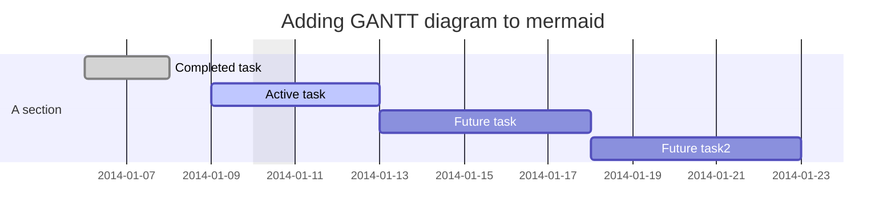
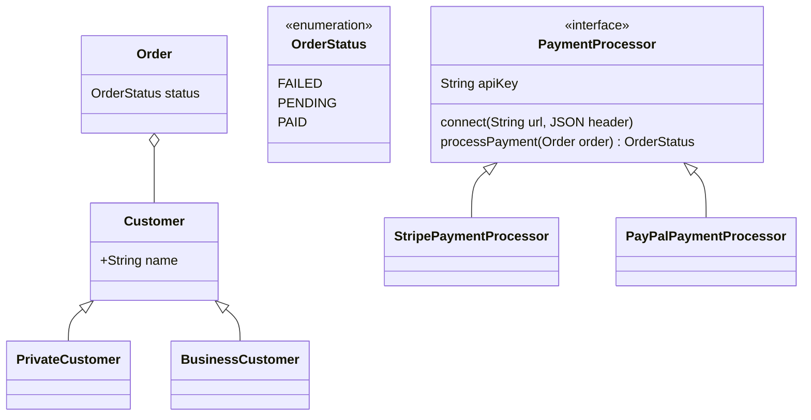
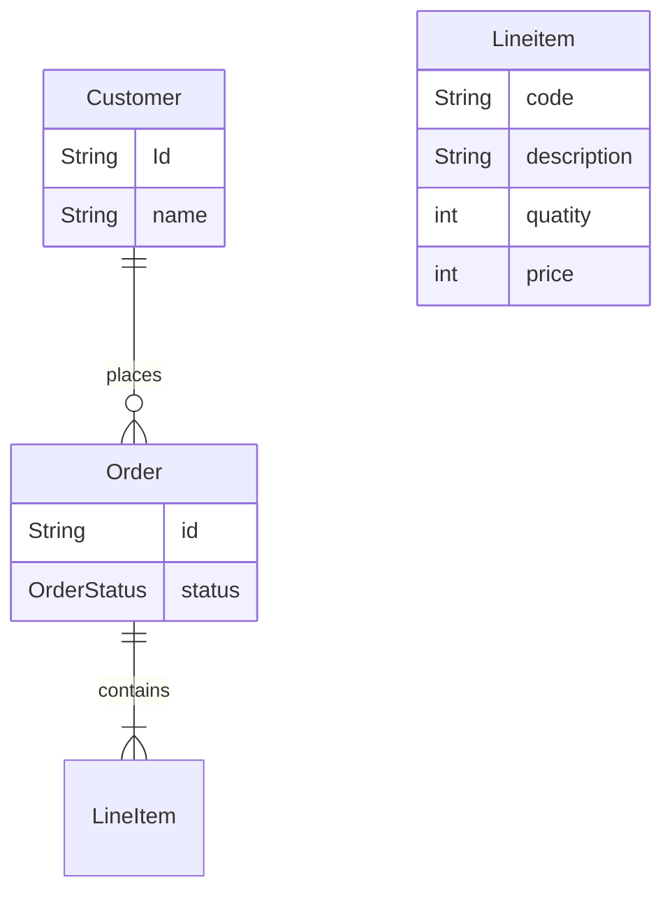

# Mermaid

## Flowchart

```mermaid
flowchart LR
    Start --> Stop
```

```mermaid
flowchart LR
    S[Start] --> A
    A(Enter your code) --> B{Age > 4}
    B -->|No| C(Enter another thing)
    B -->|yes| E(send email)
    C --> D{Accept}
    D -->|No| A
    D -->|Yes| E
```

```mermaid
flowchart LR
  A[Hard edge] -->|Link text| B(Round edge)
  B --> C{Decision}
  C -->|One| D[Result one]
  C -->|Two| E[Result two]
```

```mermaid
%%{init: {
  'theme': 'base',
  'themeVariables': {
    'primaryColor': '#6A7FAB',
    'primaryTextColor': '#FAFBF9',
    'primaryBorderColor': '#6A7FAB',
    'lineColor': '#6A7FABCC',
    'textColor': '#6A7FABCC',
    'fontSize': '16px'
  }
}}%%

graph TD
  A-->B
  A-->C
  B-->D
  C-->D
```

```mermaid
graph TD
  A[Christmas] -->|Get money| B(Go shopping)
  B --> C{Let me think}
  C -->|One| D[Laptop]
  C -->|Two| E[iPhone]
  C -->|Three| F[fa:fa-car Car]
```

```mermaid
graph LR
    A --- B
    B-->C[fa:fa-ban forbidden]
    B-->D(fa:fa-spinner);
```

## Sequence Diagram

```mermaid
sequenceDiagram;
    participant Alice
    participant Bob
    Alice ->> John: Hello John, how are you?
    loop Healthcheck
        John ->> John: Fight against hypochondria
    end
    Note right of John: Rational thoughts <br/>prevail!
    John -->> Alice: Great!
    John ->> Bob: How about you?
    Bob -->> John: Jolly good!
```

## Gantt Diagram

```mermaid
gantt
  dateFormat YYYY-MM-DD
  title Adding GANTT diagram to mermaid
  excludes weekdays 2014-01-10

  section A section
  Completed task: done, des1, 2014-01-06,2014-01-08
  Active task: active, des2, 2014-01-09, 3d
  Future task: des3, after des2, 5d
  Future task2: des4, after des3, 5d
```

## Class Diagram

```mermaid
classDiagram
  class Order {
    OrderStatus status
  }
  class OrderStatus {
    <<enumeration>>
    FAILED
    PENDING
    PAID
  }
  class PaymentProcessor {
    <<interface>>
    String apiKey
    connect(String url, JSON header)
    processPayment(Order order) OrderStatus
  }
  class Customer {
    +String name
  }
  Customer <|-- PrivateCustomer
  Customer <|-- BusinessCustomer
  PaymentProcessor <|-- StripePaymentProcessor
  PaymentProcessor <|-- PayPalPaymentProcessor
  Order o-- Customer
```

## ER Diagram

```mermaid
erDiagram
  Customer ||--o{ Order : places
  Order ||--|{ LineItem : contains
  Customer {
    String Id
    String name
  }
  Order {
    String id
    OrderStatus status
  }
  Lineitem {
    String code
    String description
    int quatity
    int price
  }
```
